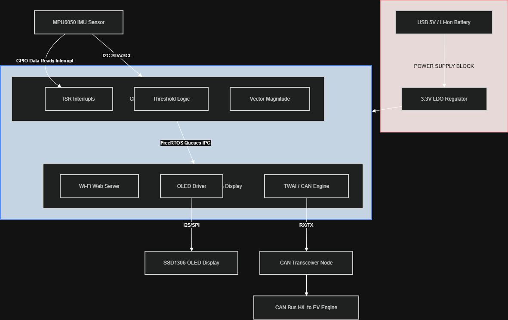

# IoT Industrial Vibration Monitor using ESP32

## Overview

Industrial vibration monitoring system developed using ESP32 and MPU6050 for real-time machine health monitoring and predictive maintenance applications.

The system continuously monitors vibration levels, processes sensor data locally, displays machine status on an OLED display, and provides remote monitoring through a web dashboard.

## Key Features

- Real-time vibration monitoring
- MPU6050 sensor integration via I2C
- OLED display visualization
- Web-based monitoring dashboard
- Threshold-based anomaly detection
- ESP32 dual-core processing
- FreeRTOS task scheduling
- CAN/TWAI communication support

## Hardware Used

- ESP32 Dev Board
- MPU6050 Accelerometer/Gyroscope
- SSD1306 OLED Display
- CAN Transceiver (Optional)

## Software Stack

- Embedded C++
- FreeRTOS
- ESP-IDF / Arduino Framework
- I2C Communication
- WiFi Networking
- CAN/TWAI Protocol

## Engineering Concepts Demonstrated

- Embedded Firmware Development
- Real-Time Operating Systems (RTOS)
- Sensor Interfacing
- Multi-tasking Applications
- Industrial IoT
- CAN Bus Communication
- Edge Monitoring Systems

## System Architecture

## Project Outcomes

- Successfully acquired vibration data from MPU6050
- Implemented real-time threshold monitoring
- Displayed live machine status on OLED
- Enabled remote dashboard monitoring
- Developed scalable firmware architecture using FreeRTOS

## Future Improvements

- MQTT Cloud Integration
- Machine Learning Based Fault Prediction
- Data Logging using SD Card
- OTA Firmware Updates
